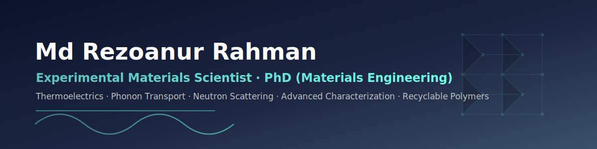

  

<table>
  <tr>
    <td width="180" valign="top">
      
    </td>
    <td valign="top">
      <h1>Md Rezoanur Rahman</h1>
      <b>Materials Engineer · Experimental Materials Scientist (PhD)</b> 
      Thermoelectric materials · Phonon transport · Advanced characterisation · Recyclable polymers  
      📍 Wollongong, NSW, Australia · 🇦🇺 Australian Permanent Resident · ✉️ rrezoan@gmail.com  
      
      
      
    </td>
  </tr>
</table>

---

## 👤 About Me

I'm an experimental materials scientist with PhD-level training in thermoelectric materials, phonon transport, and advanced characterisation. My work sits at the interface of fundamental physics and applied engineering: I design and synthesise materials, characterise them across structural, thermal, electrical, magnetic, and mechanical properties, and use neutron scattering and DFT-informed analysis to explain *why* a material behaves the way it does.

What I bring to a team is the ability to **connect laboratory evidence to engineering decisions** — troubleshooting experiments, improving repeatability, documenting workflows, and translating complex results for academic, industry, and partner-facility stakeholders. I have hands-on experience spanning university research labs (ISEM, UOW), national facilities (ANSTO, CSIRO), and a live, government-funded industry process project (recycled-PET filament with Deco Australia).

> **Open to roles in:** Materials R&D · Advanced characterisation · Postdoctoral research · Process / Quality / Manufacturing engineering — across Australia.

---

## 🧭 Roles I'm Equipped For

| Role | What I bring |
|------|--------------|
| 🧪 **Experimental / Research Scientist** | Full-pipeline experimental design, advanced characterisation, neutron-beam campaigns, DFT-informed analysis, publications |
| ⚙️ **Materials Engineer** | Processing–microstructure–property links; structural, thermal, mechanical & magnetic characterisation |
| 🔥 **Thermoelectric Scientist** | Mg₂Si / SnTe / carbon-modified systems; Seebeck, resistivity, thermal transport, phonon engineering |
| 🌡️ **Thermal Engineer** | Thermal conductivity/diffusivity (LFA, PicoTR), DSC/TGA, thermal-management materials |
| ♻️ **Recyclable-Materials & Polymer Manufacturing Engineer** | Recycled-PET filament extrusion; feedstock, dispersion & process optimisation; circular materials |
| 🧫 **Polymer Expert** | Polymer composites, nanocomposites, flexible & functional polymers; structure–property control |
| 🏭 **Process Engineer** | Parameter optimisation, repeatability, scale-up of lab processes to consistent output |
| 🔧 **R&D Engineer** | Industry + academic R&D; prototyping; troubleshooting; partner-facility collaboration |
| ✅ **Quality & Control Engineer / Officer** | SOPs, test plans, AQL, SPC, 5S, root-cause analysis, traceable records, WHS-compliant practice |
| 🧵 **Textile Engineer** | BSc Textile Engineering; spinning/knitting/weaving/dyeing/finishing; QA/QC (GSM, shrinkage, colour fastness, defect mapping) |

---

## 🎓 Education

| Degree | Institution | Years | Focus |
|--------|-------------|-------|-------|
| **PhD, Materials Engineering** | University of Wollongong, Australia | 2022–2026 *(thesis under review)* | Neutron-guided phonon engineering of carbon-modified Mg₂Si for ultra-low lattice thermal conductivity |
| **MPhil, Materials Engineering** | University of Wollongong, Australia | 2020–2022 | Engineering thermal conductivity via chemical doping and nanoparticle additives |
| **BSc, Textile Engineering** | Mawlana Bhasani Science & Technology University, Bangladesh | 2013–2018 | Surface modification of polyester woven fabric using PVA |

---

## 💼 Professional Experience

**Lead Engineer — Recycled PET Polymer Filament Project** · *Deco Australia (NSW Government-funded) × University of Wollongong · 2024–Present*
Main engineer responsible for developing an extrusion process that converts post-use PET plastic into recyclable polymer filament — optimising process parameters, feedstock consistency, dispersion, and extrusion conditions, with reporting to industry and university stakeholders.

**Casual Teaching Staff** · *University of Wollongong · 2025–Present*
Lab classes, tutorials, and instrument demonstrations; assessment with rubrics and moderation; WHS-compliant student supervision.

**Research Assistant** · *Institute for Superconducting and Electronic Materials (ISEM), UOW · 2020–Present*
Materials R&D across thermoelectric, polymer-composite, flexible-composite, and recyclable-material projects. Coordinated external campaigns with ANSTO, CSIRO, and industry partners; prepared SOPs, risk assessments, reports, publication figures, and manuscripts.

**Management Trainee Officer** · *Biochem International, Dhaka, Bangladesh · 2019*
Operations, procurement logistics, inventory, vendor/customer communication, and weekly KPI dashboards.

**Textile Engineering Intern** · *H.R. Textile Mills Ltd (Pride Group), Bangladesh · Mar–Apr 2018*
Spinning, knitting, weaving, dyeing, finishing and cut-and-sew; QA/QC including GSM, shrinkage, colour fastness, and defect mapping.

---

## 🔬 Areas of Expertise

- **Thermoelectric & energy materials** — Mg₂Si, SnTe, carbon-modified systems; processing–microstructure–property relationships.
- **Phonon & thermal transport** — lattice thermal conductivity, propagon-to-diffuson crossover, phonon scattering engineering.
- **Neutron science** — inelastic neutron scattering, phonon/vibrational density of states (VDOS/GDOS) interpretation via LAMP; neutron reflectometry.
- **Polymer & composite materials** — magnetic polymer nanocomposites, flexible composites, recyclable plastics, additive-manufacturing filaments.
- **Advanced characterisation** — full structural, thermal, electrical, magnetic, and mechanical workflows (see instruments below).
- **Data analysis & modelling** — DFT-informed interpretation of scattering and transport data; Python-based batch analysis and uncertainty estimation.
- **Process, quality & manufacturing** — extrusion process development, SOPs, SPC, AQL, root-cause analysis, WHS-compliant practice.

---

## 🧪 Instruments & Hands-On Techniques

Certified, hands-on operator across the materials characterisation and processing stack:

### 🖥️ Microscopy & Imaging
- **SEM — JEOL JSM-6490LV** · SE/BSE imaging + EDS microanalysis (high & low vacuum), 1–30 kV, to ~3 nm.
- **TEM — HRTEM / SAED** · nanoscale structure, lattice fringes, electron-diffraction crystallography.
- **Micro-CT — Bruker SkyScan 1272** · non-destructive 3D X-ray tomography (porosity/defects to 0.4 µm).
- **Sputter Coater — Edwards** · conductive coating for electron microscopy.

### 🧭 X-ray Diffraction
- **PANalytical Empyrean** · powder/thin-film XRD, residual stress, reflectivity, in-situ −200→1100 °C.
- **PANalytical Aeris** · rapid phase ID + quantitative Rietveld (<10 min).
- **GBC MMA** · crystalline phase analysis. *(Rietveld refinement in FullProf.)*

### 🌈 Spectroscopy
- **Raman — Horiba LabRAM HR Evolution** · confocal Raman + PL, multi-laser, ~1 µm hyperspectral imaging.
- **FT-IR — Shimadzu IRAffinity** · functional-group / bonding analysis (transmission, DRIFT, ATR).

### 🌡️ Thermal Analysis & Transport
- **LFA — NETZSCH 467 HyperFlash & Linseis** · thermal diffusivity/conductivity by laser flash (incl. thin films).
- **PicoTR** · picosecond thermoreflectance for thin-film thermal conductivity + interface conductance.
- **DSC — NETZSCH 204 F1** · transitions, melting/crystallization, Tg, specific heat (−180→700 °C).
- **TGA — NETZSCH 209 Libra** · thermal stability & decomposition (to 1100 °C, 0.1 µg resolution).

### ⚡ Thermoelectric & 🧲 Magnetic
- **Ozawa RZ2001i** · simultaneous Seebeck coefficient + electrical resistivity of bulk thermoelectrics.
- **VSM** · hysteresis, saturation magnetization, coercivity, remanence vs. field/temperature.
- **AC inductive (remote) heating** · magnetic-field-driven thermal response of nanocomposites.

### ⚛️ Neutron Scattering
- **Inelastic neutron scattering (ANSTO)** · lattice dynamics + phonon density of states (VDOS/GDOS); neutron reflectometry.
- **Analysis: LAMP + DFT** · interpreting phonon spectra to resolve scattering mechanisms.

### 🛠️ Synthesis, Processing & Mechanical
- **SPS — Thermal Technology** · rapid pulsed-DC densification into fine-grained, high-density compacts.
- **Hot Press · Tube Furnaces · MBraun Glovebox (<1 ppm O₂/H₂O)** · sintering, heat treatment, air-sensitive handling.
- **PLD** · stoichiometric thin-film deposition with nm-scale control.
- **MTI Ball Mill / Cryomill · 3DEVO Extruder** · milling/mechanical alloying; recycled-PET & composite filament (±0.05 mm).
- **Mechanical** · Shimadzu EZ universal tester (tensile/compression/bend); Struers DuraScan-70 (Vickers/Knoop/Brinell hardness & fracture toughness).
- **Metallography** · Struers Accutom-50 (cutting), Tegramin/Rotopol (grinding/polishing), CitoPress (mounting).
- **Polymer processing** · solution casting, blending/compounding, dispersion control, crosslinking, in-situ polymerisation, centrifugation.

---

## 🧩 Projects

**1. Carbon-Modified Mg₂Si Thermoelectric Materials** *(PhD core project)*
*Goal:* reduce the lattice thermal conductivity of Mg₂Si thermoelectrics through carbon-induced interfaces and defects, without destroying electrical performance.
*What I did:* carbon/Bi co-doping and synthesis, then a full characterisation chain — XRD → SEM/EDS → TEM → thermal & electrical transport → neutron spectroscopy → DFT-informed interpretation.
*Solved:* built an evidence-based picture linking carbon-induced defects to phonon scattering and reduced thermal transport — the backbone of my PhD thesis and two manuscripts in preparation.

**2. Neutron Scattering & Phonon Engineering**
*Goal:* understand how carbon allotropes and Mg₂Si systems vibrate, and how that controls heat flow.
*What I did:* inelastic neutron scattering campaigns at ANSTO; interpreted VDOS/GDOS via LAMP; compared microdiamond, few-layer graphene, and amorphous carbon fibres.
*Solved:* first-author publication in *Applied Physics Letters* (2026); contributed to identifying the propagon-to-diffuson thermal-transport crossover in SnTe (*J. Appl. Phys.* 2025).

**3. Polymer, Recycled Plastic & Composite Filament Development**
*Goal:* turn post-use PET and composite feedstocks into reliable, recyclable filaments for thermal management and 3D printing.
*What I did:* as Lead Engineer on the Deco Australia × UOW (NSW Government-funded) project, developed and optimised an extrusion process — feedstock consistency, dispersion, parameters; characterised output with Micro-CT and thermal analysis.
*Solved:* established a repeatable process producing strong, consistent results; delivered against an industry + government program with external reporting.

**4. Magnetic Polymer Nanocomposites (Fe₃O₄ / Polyurethane)**
*Goal:* exploit the coupling between thermal and magnetic behaviour in superparamagnetic polymer composites.
*What I did:* synthesised Fe₃O₄/polymer systems; characterised with VSM, AC inductive (remote) heating, and thermal conductivity.
*Solved:* first-author publication in *J. Magnetism and Magnetic Materials* (2023) mapping the thermal–magnetic interplay — relevant to remote-heating and smart-material applications.

**5. Flexible Thermoelectric & Wearable Composite Prototypes**
*Goal:* translate thermoelectric and composite materials into manufacturable, flexible prototypes.
*What I did:* hot pressing, lamination, and bonding of flexible composites with a focus on manufacturability.
*Solved:* demonstrated prototype routes that bridge material performance and practical fabrication constraints.

**6. Textile Engineering & Manufacturing Quality** *(foundations)*
*Goal:* link process parameters to product quality in a high-volume manufacturing environment.
*What I did:* hands-on across spinning, knitting, weaving, dyeing, finishing and cut-and-sew; applied AQL, SPC, and 5S.
*Solved:* built early, practical fluency in manufacturing quality systems that now underpins my process-engineering work.

---

## 📚 Selected Publications

| Year | Work | Venue | Role |
|------|------|-------|------|
| 2026 | [Comparing the phonons and vibrations in carbon allotropes with neutron spectroscopy](https://doi.org/10.1063/5.0314605) | *Applied Physics Letters* 128, 122204 | First author |
| 2025 | [Crossover from propagon to diffuson thermal transport in SnTe](https://doi.org/10.1063/5.0292504) | *Journal of Applied Physics* 138, 165102 | Co-author |
| 2024 | [Phonon engineering in thermal materials with nano-carbon dopants](https://doi.org/10.1063/5.0173675) | *Applied Physics Reviews* 11, 021336 | Co-author |
| 2023 | [Interplay between thermal and magnetic properties of Fe₃O₄ polymer nanocomposites](https://doi.org/10.1016/j.jmmm.2023.170859) | *J. Magnetism & Magnetic Materials* 579, 170859 | First author |
| 2022 | Iron oxide–Palladium core–shell nanospheres for FMR-based hydrogen gas sensing | *Int. J. Hydrogen Energy* 47, 8155–8163 | Co-author |
| 2021 | Structure and magnetism of ultra-small cobalt particles embedded in titania | *Applied Surface Science* 570, 151068 | Co-author |

📄 *In preparation:* defect-engineered Mg₂Si with carbon–oxygen expansion and Bi contraction; neutron-scattering study of carbon-fibre-induced phonon scattering in Mg₂Si. Full list on [Google Scholar](https://scholar.google.com/citations?user=mVl-F_oAAAAJ&hl=en) and [ORCID](https://orcid.org/0000-0002-7678-6439).

---

## 🤝 Soft Skills

Stakeholder communication · Cross-facility collaboration (ANSTO, CSIRO, UOW) · Teaching & mentoring · Problem-solving & experimental troubleshooting · Documentation & rigour (SOPs, traceable datasets) · End-to-end project ownership · Resilience & adaptability.

---

## 🏅 Awards, Memberships & Training

- 🥇 **Best Poster** — 46th Annual Condensed Matter and Materials Meeting, Wagga Wagga (2024)
- 🎓 **University Postgraduate Award**, UOW (2022) · **International Postgraduate Tuition Award**, UOW (2021)
- 👥 Member: **FLEET** (ARC Centre of Excellence) · **Australian Institute of Physics** (AIP) · **Engineers Australia** (EA)
- 📋 Training: Certificate IV in Work Health and Safety (continuing) · Liquid Nitrogen & Gas Care (UOW, 2021/2023)
- 🤝 Collaborations: ISEM (UOW) · ANSTO · CSIRO Manufacturing (Clayton, Melbourne)

---

## 🧰 Tools

---

## 📈 GitHub Stats

  

---

📧 rrezoan@gmail.com · Wollongong, NSW, Australia · Australian Permanent Resident · <i>Connecting laboratory evidence to engineering decisions.</i>

